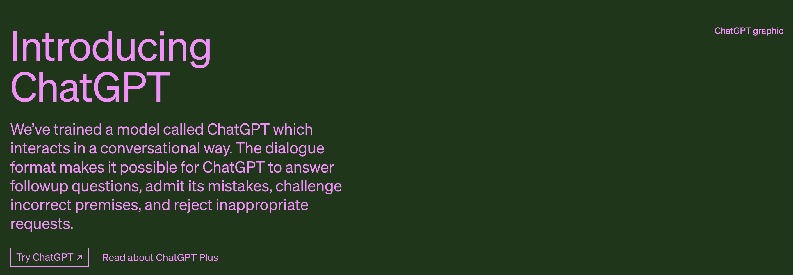

<h1>🧠 Awesome-ChatGPT </h1>

  

ChatGPT material summary study, continuously updated ......  
ChatGPT once again set off the AI fever, whether it will still be a milestone event on the AI process like BERT, or gimmicky hype, continue to pay attention to let the time flow

   

## Flybook Knowledge Base-🔥 Keeping up with the AIGC winds Knowledge Base
The knowledge base currently includes the following content outline, covering the following topics
- ChatGPT basics, registration process, login problem solving, related applications, including plug-ins, role-playing Prompt, and PDF information
- Domestic big model related progress, information, and its related internal testing application process, Baidu, Ali, Shangtang, 360, Kunlun Wanwei, etc.
- Overseas Google, Microsoft big model progress, New Bing related issues
- Domestic available some free websites (as of now free)
- AI painting, especially MJ, SD data collection, the use of tutorials, practice sharing, etc.
- Prompt prompt word has been a part of the non-negligible, must master some information
- AI high-quality articles included
- Technology Zone
- AI tools collection
- AI navigation site summary
- 3000+ people community
- Address: https://szqxz4m7fs.feishu.cn/wiki/wikcnMJ5qdVdOJ03XsBZFuXIRkf

- Join this small circle without a penny. ai, growth, side business, reading, workplace, experience, wherever you want to talk about it, ranting and rambling, beneficial to their own growth, the best for others to be inspired!
- Limited to 1000 people: https://t.zsxq.com/0fykt2A4a

| Pulled you into the 500 people group (Remarks ChaGPT-github) | Sweep the code to join the group |
| ----  | ----  |
|  |  | 

## GPT-4
【GPT-4】 [GPT-4 shocking release: multimodal large model, directly upgrade ChatGPT, Bing, open API, game over?](https://mp.weixin.qq.com/s/kA7FBZsT6SIvwIkRwFS-xw)  
【GPT-4】[GPT4 Shocking Release! Harvard professor: programmer career will be ended in 3 years](https://mp.weixin.qq.com/s/c0KR3Jv_1Y3216N7SlOO3Q)  
【Real Testing】[GPT3.5-GPT4-Baidu Wenxin Yiyin, the gap is still quite big](https://docs.qq.com/sheet/DTEFsdkNERVVtR3BX)  
【PDF material】[OpenAI released GPT-4, the development of large models into a new milestone.pdf](GPT4相关/OpenAI发布GPT-4，大模型的发展进入新的里程碑.pdf)  
【PDF material】[GPT-4-Shocking release, the top of AI algorithms.pdf](GPT4相关/GPT-4震撼发布-AI算法之巅.pdf)  
【PDF material】[GPT-4-Technical-Report-Chinese.pdf](PT4相关/GPT-4技术报告.pdf)  
【PDF material】[GPT-4 Technical Report.pdf](GPT4相关/gpt-4.pdf)  
【More】 https://szqxz4m7fs.feishu.cn/wiki/QpqewmZSjiaNFqkDujSc0Pfjntb

## Baidu-Wenxin Yiyin
【Literally a word】[Literally a word, looking forward to meeting you](https://mp.weixin.qq.com/s/tUGwuNQi9UjSPVyeEGVEsQ)  
【PDF material】[Huatai Securities: Wenxin Yiyin: Technology and Capability Demolition.pdf](百度-文心/华泰证券：文心一言：技术与能力拆解.pdf)  
【PDF material】[Huaxi Securities: Baidu Wenxin Yiyin Changyi.pdf](百度-文心/华西证券：百度文心一言畅想.pdf)  
【PDF material】[Open Source Securities: Baidu Wenshin Yiyin Outlook.pdf](百度-文心/开源证券：百度文心一言展望.pdf)  
【PDF material】[Capital Securities: Wenxin Yiyin Accesses Eco-Partners, AIGC Concerns Continue.pdf](百度-文心/首创证券：文心一言接入生态伙伴，AIGC关注度持续.pdf)  
【PDF material】[ChatGPT Series - Baidu Wenxin Yiyin Interpretation 20230315.pdf](百度-文心/ChatGPT系列—百度文心一言解读20230315.pdf)  
【PDF material】[Wenxin Yiyin Test Guidelines.pdf](百度-文心/文心一言测试指引.pdf)  
【更多】https://szqxz4m7fs.feishu.cn/wiki/QpqewmZSjiaNFqkDujSc0Pfjntb

## Newsletters

【Current event】[Google Releases Bard to Compete with ChatGPT](https://hub.baai.ac.cn/view/23925)  
【Current event】[Microsoft releases ChatGPT version of search engine with more powerful technology than ChatGPT](https://www.36kr.com/p/2122399289378949)  
【Current event】[Today, Microsoft reinvented the search engine: the first ChatGPT search is here!](https://mp.weixin.qq.com/s/bZlpr4BhL4wpiE0TQovuxg)  
【Current event】[Witness history: ChatGPT version of search engine debuts with 12 new experiences that are just stunning](https://36kr.com/p/2123086022363273)  
【CCTV network】[Actual test "cottage" ChatGPT: the cost is quite high, the answer is outrageous!](https://mp.weixin.qq.com/s/3TF7Yb2uC1PW22K-aSZ3fw)  
【CCTV4】[ChatGPT Rampage! Tech giants are laying out](https://mp.weixin.qq.com/s/DGyOK2L-zOhODtWvf-wn-A)  
【Heart of the Machine】[Microsoft ChatGPT version of Bing hacked, all Prompts leaked](https://mp.weixin.qq.com/s/89KeLjDoS9IyArIr8z6jjg)  
【Fudan University, Shanghai】[Information｜Fudan team releases China's first ChatGPT-like model MOSS, invites the public to participate in internal testing](https://fddi.fudan.edu.cn/5b/e2/c21257a482274/page.htm)  
【Lee Kai-Fu】[Kai-Fu Lee's latest 10,000-word speech: AI 2.0 is a revolution that absolutely cannot be missed](https://mp.weixin.qq.com/s/ddGbZd78BEd65L7599V3Cw)  
【Microsoft】[Last night, Microsoft dumped the Office kingpin! Another AI godsend to save the beatniks](https://mp.weixin.qq.com/s/DpBo4p9yhlRcERzcbyBQBg)  
【Ren Zhengfei】[Ren's latest talk on China and the U.S., tech, ChatGPT](https://mp.weixin.qq.com/s/7Njd3TYE8PNiKd2M37eGuw)

## 论文

【OpenAI Official Website】[ChatGPT Blog](https://openai.com/blog/chatgpt/)  
【ChatGPTPro】[ChatGPTPro](https://chatgpt.pro/)  
【GPT-1 Thesis】[Improving Language Understanding by Generative Pre-Training](https://cdn.openai.com/research-covers/language-unsupervised/language_understanding_paper.pdf)  
【GPT-2 Thesis】[Language Models are Unsupervised Multitask Learners](https://cdn.openai.com/better-language-models/language_models_are_unsupervised_multitask_learners.pdf)  
【GPT-3 Thesis】[Language Models are Few-Shot Learners](https://arxiv.org/abs/2005.14165)  
【InstructGPT Thesis】[Training language models to follow instructions with human feedback](https://arxiv.org/pdf/2203.02155.pdf)  
【RHLF Thesis】[Augmenting Reinforcement Learning with Human Feedback](https://www.cs.utexas.edu/~ai-lab/pubs/ICML_IL11-knox.pdf)  
【12 papers related to RHLF】[RHLF Proceedings](PDF/RLHF论文集/)  
【PPO Algorithm Paper】[Proximal Policy Optimization Algorithms](https://arxiv.org/abs/1707.06347)  
【Sparrow】[Improving alignment of dialogue agents via targeted human judgements](https://arxiv.org/abs/2209.14375)  
【LaMda】[LaMDA: Language Models for Dialog Applications](https://arxiv.org/abs/2201.08239)

## Tripartite code implementation
【Code implementation】 **ColossalAI** [hpcaitech/ColossalAI/ChatGPT](https://github.com/hpcaitech/ColossalAI/tree/main/applications/ChatGPT) , :+1: 如何使用可参考:[博客介绍](https://www.hpc-ai.tech/blog/colossal-ai-chatgpt)

## Materials

【PDF Material】[ChatGPT - Zenith Fund Sharing.pdf](PDF/ChatGPT-真格基金分享.pdf)  
【PDF Material】[Tencent Research Institute AIGC Development Trend Report 2023.pdf](PDF/腾讯研究院AIGC发展趋势报告2023.pdf)  
【PDF Material】[From CHAT_GPT to Generative AI: A New Paradigm for Artificial Intelligence that Redefines Productivity.pdf](PDF/从CHAT_GPT到生成式AI.pdf)  
【PDF Material】[ChatGPT - Starting a New Era of AI.pdf](PDF/ChatGPT-开启AI新纪元.pdf)  
【PDF Material】[ChatGPT research framework](https://mp.weixin.qq.com/s/YtJn2pfdS_on1nSATOylYw)  
【PDF Material】[ChatGPT Research Framework 2023.pdf](PDF/ChatGPT研究框架2023.pdf)  
【PDF Material】[AIGC Industry In-depth Report-ChatGPT-Redefining the Search "Portal".pdf](PDF/AIGC行业深度报告-ChatGPT-重新定义搜索“入口”.pdf)  
【PDF Material】[ChatGPT in three minutes.pdf](PDF/三分钟看懂ChatGPT.pdf)  
【PDF Material】[From ChatGPT to General Intelligence on the New Long March.pdf](PDF/从ChatGPT到通用智能新长征上的新变化.pdf)  
【PDF Material】[How Tools Like ChatGPT Can Transform Your Business.pdf](PDF/像ChatGPT这样的工具如何改变你的企业.pdf)  
【PDF Material】[Unveiling the AIGC technology behind ChatGPT and its Chinese counterparts.pdf](PDF/揭秘ChatGPT身后的AIGC技术和它的中国同行们.pdf)  
【PDF Material】[ChatGPT_Prompts_Usage.pdf](PDF/ChatGPT/ChatGPT_Prompts_使用场景.pdf)  
【PDF Material】[ChatGPT Past Present and Future.pdf](PDF/ChatGPT/ChatGPT过去现在与未来.pdf)   
【更多】https://szqxz4m7fs.feishu.cn/wiki/QpqewmZSjiaNFqkDujSc0Pfjntb

## Technical Interpretation

【Technical Interpretation】[Huggingface Interpretation Illustrating Reinforcement Learning from Human Feedback (RLHF) ](https://huggingface.co/blog/rlhf)  
【Technical Interpretation】[ChatGPT Development History, Principles, Technology Architecture Details and Industry Future (Included in Advanced AI Technology In-depth Explanation)](https://zhuanlan.zhihu.com/p/590655677)  
【Technical Interpretation】[ChatGPT kernel: InstructGPT, PPO reinforcement learning based on feedback instructions](https://zhuanlan.zhihu.com/p/589747432)  
【Technical Interpretation】[HuggingFace - Decoding the Tech Focus Behind ChatGPT: RLHF, IFT, CoT, Red-Blue Confrontation](https://zhuanlan.zhihu.com/p/602458131)  
【Technical Interpretation】[Implementing ChatGPT from scratch - RLHF Technical Notes](https://zhuanlan.zhihu.com/p/591474085)  
【Technical Interpretation】[Junlin Zhang - The Road to AGI: Technical Essentials of Large Scale Language Modeling (LLM)](https://zhuanlan.zhihu.com/p/597586623)  
【Technical Interpretation】[ChatGPT/InstructGPT Details](https://zhuanlan.zhihu.com/p/590311003)  
【Technical Interpretation】[ Xaar Notes | Analyzing the principle and application of ChatGPT ](https://mp.weixin.qq.com/s/wLVoY6BwWd9p4DqrpOMOxg)  
【Technical Interpretation】[Hugging Face: The Algorithm Behind ChatGPT - RLHF | With 12 RLHF Must-Brush Papers (Papers in the profile above)](https://zhuanlan.zhihu.com/p/592671478)  
【Technical Interpretation】[Artificial intelligence algorithms behind ChatGPT were all invented by foreign companies](https://xueqiu.com/5760078642/241228577)  
【Technical Interpretation】[10,000 Word Teardown! Tracing the origins of the various ChatGPT capabilities](https://mp.weixin.qq.com/s/VYv8BRgGnp9ZTuXxaSuFwg)  
【Technical Interpretation】[Disassembling and Tracing the Origins of the GPT-3.5 Competencies](https://yaofu.notion.site/GPT-3-5-360081d91ec245f29029d37b54573756)  
【Technical Interpretation】[Are we really facing a paradigm shift when ChatGPT comes out?](https://mp.weixin.qq.com/s/60_h5biTOlBAa3Rt2tMn6A)  
【Technical Interpretation】[Tencent technical engineering | 10,000 words long article to teach you how to make ChatGPT](https://mp.weixin.qq.com/s/8IFcQDhsLIWJIx8siF-wdQ)  
【Tencent】[The five most important questions about ChatGPT](https://mp.weixin.qq.com/s/ACMAeGi0LPRWt2B8VrIojQ)

## Video Presentation
【Li Hongyi】[How ChatGPT (Probably) Was Made - The GPT Socialization Process](https://www.bilibili.com/video/BV1U84y167i3?p=1&vd_source=71b548de6de953e10b96b6547ada83f2)   
【Chan Wing Nong】[Deep Learning Applications | ADL 17.3: OpenAI ChatGPT: A Conversational and Interactive AI that Amazes People](https://www.bilibili.com/video/BV1U84y167i3?p=3&vd_source=71b548de6de953e10b96b6547ada83f2)  
【fig. wash in the open】[InstructGPT Dissertation Intensive Reading [Dissertation Intensive Reading-48]](https://www.bilibili.com/video/BV1hd4y187CR/?spm_id_from=333.788&vd_source=71b548de6de953e10b96b6547ada83f2)  
【Fuel line】[A simple and clear introduction to the basic workings of ChatGPT](https://www.youtube.com/watch?v=e0aKI2GGZNg&t=24s)

## Chinese ChatGPT
【Fudan University】[Information｜Fudan team releases China's first ChatGPT-like model MOSS, invites the public to participate in internal testing](https://fddi.fudan.edu.cn/5b/e2/c21257a482274/page.htm)  
【Fudan Moss】[https://moss.fastnlp.top/](https://moss.fastnlp.top/)  
【Fudan Moss GitHub】[https://github.com/txsun1997/MOSS](https://github.com/txsun1997/MOSS)

## GitHub-ChatGPT

【GitHub】[Quickly access ChatGPT on WeChat and make it your best assistant!](https://github.com/fuergaosi233/wechat-chatgpt)  
【GitHub】[Reverse Engineered ChatGPT API by OpenAI. Extensible for chatbots etc.](https://github.com/acheong08/ChatGPT)  
【github】[This is a collection of prompt examples to be used with the ChatGPT model.](https://github.com/f/awesome-chatgpt-prompts)  
【GitHub】[ChatGPT Desktop Application (Mac, Windows and Linux)](https://github.com/lencx/ChatGPT)  
【GitHub】[ChatGPT Chinese Tuning Guide](https://github.com/PlexPt/awesome-chatgpt-prompts-zh)  
【GitHub】[Node.js client for the unofficial ChatGPT API.](https://github.com/transitive-bullshit/chatgpt-api)  
【GitHub】[Get a ChatGPT-based WeChat bot in a few steps!](https://github.com/AutumnWhj/ChatGPT-wechat-bot)  
【GitHub】[ChatGPT for Google](https://github.com/wong2/chatgpt-google-extension)    
【GitHub】[Curated list of resources for ChatGPT and GPT-3 from OpenAI](https://github.com/humanloop/awesome-chatgpt)  
【GitHub】[Reverse engineering SDK for OpenAI ChatGPT. use the latest ChatGPT directly from the web.](https://github.com/PlexPt/chatgpt-java)  
【GitHub】[ChatGPT Android demonstrates OpenAI's ChatGPT on Android with Stream Chat SDK for Compose.](https://github.com/skydoves/chatgpt-android)  
【GitHub】[ChatGPT Extension for VSCode](https://github.com/mpociot/chatgpt-vscode)  
【GitHub】[ChatGPT Desktop App](https://github.com/sonnylazuardi/chatgpt-desktop)  
【GitHub】[PyChatGPT](https://github.com/rawandahmad698/PyChatGPT)  
【GitHub】[OpenAI Teams Bot app](https://github.com/formulahendry/openai-teams-bot)  
【GitHub】[chatgpt.js client-side library](https://github.com/chatgptjs/chatgpt.js)  
【GitHub】[ChatGPT Auto Refresh keeps ChatGPT sessions fresh to avoid network errors + Cloudflare checks](https://github.com/adamlui/chatgpt-auto-refresh)  
【GitHub】[DuckDuckGPT adds ChatGPT to DuckDuckGo](https://github.com/kudoai/duckduckgpt)  
【GitHub】[BraveGPT adds ChatGPT to Brave Search](https://github.com/kudoai/bravegpt)  
【GitHub】[ChatGPT Auto-Continue automatically continues generating multi-message responses](https://github.com/adamlui/chatgpt-auto-continue)  
【GitHub】[ChatGPT Infinity generates endless answers to random questions in any language](https://github.com/adamlui/chatgpt-infinity)  
【GitHub】[ChatGPT Widescreen adds widescreen + full-window modes](https://github.com/adamlui/chatgpt-widescreen)  
【GitHub】[Autoclear ChatGPT History](https://github.com/adamlui/autoclear-chatgpt-history)

## GitHub-ChatGPT-Perimeter
【ChatRWKV】[ChatRWKV is like ChatGPT but powered by my RWKV language model](https://github.com/BlinkDL/ChatRWKV)

## GitHub-GPT Series
【GPT系列项目】[GPT2-Chinese](https://github.com/Morizeyao/GPT2-Chinese)

## 实践

【实践】[量子位-ChatGPT能接入微信了！](https://zhuanlan.zhihu.com/p/590505058)  
【实践】[在国内，如何玩一下chatgpt？](https://www.zhihu.com/question/570939438)  
【小白注册教程】[ChatGPT 怎么用最新详细教程-新手小白一看就会](https://www.cnblogs.com/chat-gpt/p/how-to-use-chatgpt-in-china.html)  
【飞书】[飞书接入ChatGPT教程](https://github.com/bestony/ChatGPT-Feishu)

## Fulfill

【Q&A from Zhihuai】[ChatGPT explodes in popularity, Google invests in its competing companies, and Google's founder himself comes down to change the code - what's the impact of this AI storm on the giants?](https://www.zhihu.com/question/582114806)  
【Q&A from Zhihuai】[What are some amazing ways to use ChatGPT?](https://www.zhihu.com/question/570729170)  
【Q&A from Zhihuai】[How high are the technical barriers to Chat GPT? Who else besides OpenAI can achieve a similar level domestically and internationally? ?](https://www.zhihu.com/question/581806122)  
【Q&A from Zhihuai】[What are the barriers that prevent domestic teams from working on a product like ChatGPT, technology, money, or leadership?](https://www.zhihu.com/question/570782945)  
【Q&A from Zhihuai】[How much of a technological revolution will the 'Big Model' represented by ChatGPT be? What are the conditions that need to be in place if a technological revolution is to occur?](https://www.zhihu.com/question/581311491)  
【Q&A from Zhihuai】[China's First ChatGPT Detector Released, How Does It Distinguish Between Humans and AI? What else can we do?](https://www.zhihu.com/question/578268304)  
【Q&A from Zhihuai】[Will OpenAI's super-conversation model ChatGPT lead to mass unemployment of programmers?](https://www.zhihu.com/question/570403406)  
【Q&A from Zhihuai】[How far is ChatGPT from being truly commercialized on the ground?](https://www.zhihu.com/question/578492084)  
【Q&A from Zhihuai】[What has ChatGPT already done to coders?](https://www.zhihu.com/question/579037511)  
【Q&A from Zhihuai】[Will the emergence of ChatGPT lead to unemployment for the underlying programmers?](https://www.zhihu.com/question/570596331)  
【Q&A from Zhihuai】[Is there a model in the country with similar capabilities to ChatGPT?](https://www.zhihu.com/question/570713548)  
【Q&A from Zhihuai】[How do you rate ChatGPT? Will it replace search engines?](https://www.zhihu.com/question/570062224)  
【Zhang Junlin】[Will ChatGPT replace search engines?](https://zhuanlan.zhihu.com/p/589533490)  
【New Intellectual Capital】[ChatGPT bursts into flames, LeCun's mind is broken! Calling big language modeling evil, Meta modeling goes offline in 3 days of misery](https://mp.weixin.qq.com/s/Q9H-78VyI1tZ_9u1kvF_nA)  
【Q&A from Zhihuai】[What to say about ChatGPT, OpenAI's super-conversation model?](https://www.zhihu.com/question/570189639)  
【Q&A from Zhihuai】[Baidu's ChatGPT-like project name is confirmed as "Wenxin Yiyin" and internal testing will be completed in March, what information is worth paying attention to?](https://www.zhihu.com/question/582588618)  
【Google CEO】[An important next step on our AI journey](https://blog.google/technology/ai/bard-google-ai-search-updates/)  
【Q&A from Zhihuai】[How will OpenAI's ChatGPT affect NLP research in China?](https://www.zhihu.com/question/571460238)  
【Quantum Lepton】[ChatGPT Stealing Home: Stack Overflow Is Being Abandoned by Programmers, Visits Plunge 3200W in a Month](https://zhuanlan.zhihu.com/p/602818608)  
【ChatGPT之父】[ Conversation with the father of ChatGPT! What will AI change? What won't it change?](https://mp.weixin.qq.com/s/B5Aku-r4jQYVfO89jxu_Xg)  
【Q&A from Zhihuai】[Which areas are most likely to be replaced by ChatGPT?](https://www.zhihu.com/question/582498339/answer/2918852536)  
【Q&A from Zhihuai】[What are the most useful Prompts (Prompts) to write for ChatGPT?](https://www.zhihu.com/question/584402332)

## Welcome to build together
[👬🏻], Welcome 👏🏻 Star ⭐️⭐️⭐️⭐️⭐️ && Submit Pull requests 👏🏻👏🏻👏🏻

## Communications
The group is full add my wechat (note github-ChatGPT), the road is difficult, thanks to the boss random reward

    

## About me.
Dalin, NLP/Knowledge Graph Algorithm Engineer  
v: dalinvip2023

### Star History

# ⚠️ Statement
The above information from the network organization, for your study reference, if any infringement, please contact me to delete!  
v: dalinvip2023