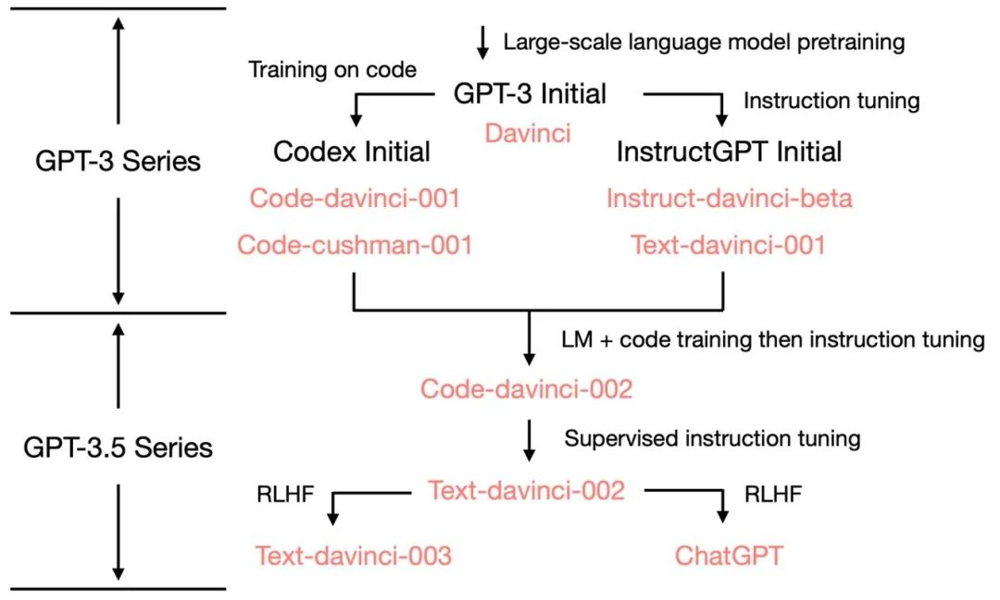
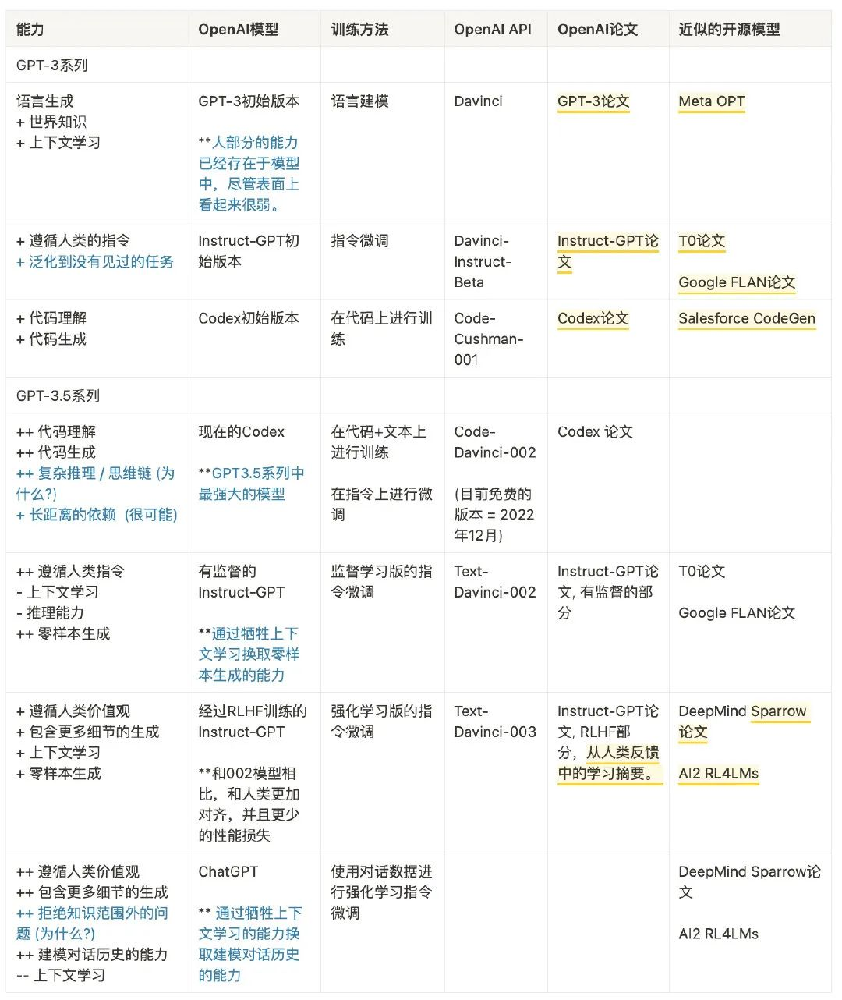

# Awesome-ChatGPT
ChatGPT资料汇总学习，持续更新......  
ChatGPT再一次掀起了AI的热潮，是否还会像BERT一样成为AI进程上的里程碑事件，还是噱头炒作，持续关注，让时间流淌~

   

# 论文
【OpenAI官方网站】[ChatGPT Blog](https://openai.com/blog/chatgpt/)  
【ChatGPTPro】[ChatGPTPro](https://chatgpt.pro/)  
【GPT-1论文】[Improving Language Understanding by Generative Pre-Training](https://cdn.openai.com/research-covers/language-unsupervised/language_understanding_paper.pdf)  
【GPT-2论文】[Language Models are Unsupervised Multitask Learners](https://cdn.openai.com/better-language-models/language_models_are_unsupervised_multitask_learners.pdf)  
【GPT-3论文】[Language Models are Few-Shot Learners](https://arxiv.org/abs/2005.14165)  
【InstructGPT论文】[Training language models to follow instructions with human feedback](https://arxiv.org/pdf/2203.02155.pdf)  
【RHLF论文】[Augmenting Reinforcement Learning with Human Feedback](https://www.cs.utexas.edu/~ai-lab/pubs/ICML_IL11-knox.pdf)  
【RHLF相关论文12篇】[RHLF论文集](PDF/RLHF论文集/)  
【PPO算法论文】[Proximal Policy Optimization Algorithms](https://arxiv.org/abs/1707.06347)  

# 资料
【PDF资料】[ChatGPT-真格基金分享.pdf](PDF/ChatGPT-真格基金分享.pdf)  
【PDF资料】[腾讯研究院AIGC发展趋势报告2023.pdf](PDF/腾讯研究院AIGC发展趋势报告2023.pdf)  
【PDF资料】[从CHAT_GPT到生成式AI（Generative AI）：人工智能新范式，重新定义生产力.pdf](PDF/从CHAT_GPT到生成式AI.pdf)  
【PDF资料】[ChatGPT - 开启AI新纪元.pdf](PDF/ChatGPT-开启AI新纪元.pdf)  

# 技术解读
【技术解读】[huggingface解读 Illustrating Reinforcement Learning from Human Feedback (RLHF) ](https://huggingface.co/blog/rlhf)  
【技术解读】[ChatGPT发展历程、原理、技术架构详解和产业未来 （收录于先进AI技术深度解读）](https://zhuanlan.zhihu.com/p/590655677)  
【技术解读】[ChatGPT内核：InstructGPT，基于反馈指令的PPO强化学习](https://zhuanlan.zhihu.com/p/589747432)  
【技术解读】[HuggingFace-解读 ChatGPT 背后的技术重点：RLHF、IFT、CoT、红蓝对抗](https://zhuanlan.zhihu.com/p/602458131)  
【技术解读】[从零实现ChatGPT——RLHF技术笔记](https://zhuanlan.zhihu.com/p/591474085)  
【技术解读】[张俊林-通向AGI之路：大型语言模型（LLM）技术精要](https://zhuanlan.zhihu.com/p/597586623)  
【技术解读】[ChatGPT/InstructGPT详解](https://zhuanlan.zhihu.com/p/590311003)  
【技术解读】[ 赛尔笔记 | 浅析ChatGPT的原理及应用 ](https://mp.weixin.qq.com/s/wLVoY6BwWd9p4DqrpOMOxg)  
【技术解读】[抱抱脸：ChatGPT背后的算法——RLHF | 附12篇RLHF必刷论文(论文在上面资料中)](https://zhuanlan.zhihu.com/p/592671478)  
【技术解读】[ChatGPT背后人工智能算法全部由国外公司发明](https://xueqiu.com/5760078642/241228577)  
【技术解读】[万字拆解！追溯ChatGPT各项能力的起源](https://mp.weixin.qq.com/s/VYv8BRgGnp9ZTuXxaSuFwg)  
【技术解读】[拆解追溯 GPT-3.5 各项能力的起源](https://yaofu.notion.site/GPT-3-5-360081d91ec245f29029d37b54573756)  
【技术解读】[ChatGPT出来后，我们是否真的面临范式转变?](https://mp.weixin.qq.com/s/60_h5biTOlBAa3Rt2tMn6A)  
# 视频讲解
【李宏毅】[ChatGPT (可能)是怎麼煉成的 - GPT 社會化的過程](https://www.bilibili.com/video/BV1U84y167i3?p=1&vd_source=71b548de6de953e10b96b6547ada83f2)   
【陈縕侬】[深度學習之應用 | ADL 17.3: OpenAI ChatGPT 驚驗眾人的對話互動式AI](https://www.bilibili.com/video/BV1U84y167i3?p=3&vd_source=71b548de6de953e10b96b6547ada83f2)

# 中文ChatGPT
【魔改】[ 首个中文版ChatGPT来了：大模型的中国元“Yuan” ](https://mp.weixin.qq.com/s/riaR6FBoF1_vNT4zomyS1A)  

# Github-ChatGPT
【Github】[在微信上迅速接入 ChatGPT，让它成为你最好的助手！](https://github.com/fuergaosi233/wechat-chatgpt)  
【Github】[Reverse Engineered ChatGPT API by OpenAI. Extensible for chatbots etc.](https://github.com/acheong08/ChatGPT)  
【github】[This is a collection of prompt examples to be used with the ChatGPT model.](https://github.com/f/awesome-chatgpt-prompts)  
【Github】[ChatGPT Desktop Application (Mac, Windows and Linux)](https://github.com/lencx/ChatGPT)  
【Github】[ChatGPT 中文调教指南](https://github.com/PlexPt/awesome-chatgpt-prompts-zh)  
【Github】[Node.js client for the unofficial ChatGPT API.](https://github.com/transitive-bullshit/chatgpt-api)  
【Github】[几步即可获得一个基于 ChatGPT 的微信机器人](https://github.com/AutumnWhj/ChatGPT-wechat-bot)  
【Github】[ChatGPT for Google](https://github.com/wong2/chatgpt-google-extension)    
【Github】[Curated list of resources for ChatGPT and GPT-3 from OpenAI](https://github.com/humanloop/awesome-chatgpt)  

# Github-ChatGPT-周边
【ChatRWKV】[ChatRWKV is like ChatGPT but powered by my RWKV language model](https://github.com/BlinkDL/ChatRWKV)  

# 实践
【实践】[量子位-ChatGPT能接入微信了！](https://zhuanlan.zhihu.com/p/590505058)  
【实践】[在国内，如何玩一下chatgpt？](https://www.zhihu.com/question/570939438)  
【小白注册教程】[ChatGPT 怎么用最新详细教程-新手小白一看就会](https://www.cnblogs.com/chat-gpt/p/how-to-use-chatgpt-in-china.html)  

# 相关文章
【知乎问答】[ChatGPT 爆火，谷歌投资其竞品公司，谷歌创始人亲自下场改代码，这场 AI 风暴对巨头们有何冲击？](https://www.zhihu.com/question/582114806)  
【知乎问答】[ChatGPT 有哪些神奇的使用方式？](https://www.zhihu.com/question/570729170)  
【知乎问答】[Chat GPT有多高的技术壁垒？国内外除了OpenAI还有谁可以做到类似程度？ ?](https://www.zhihu.com/question/581806122)  
【知乎问答】[阻碍国内团队研究 ChatGPT 这样产品的障碍有哪些，技术，钱，还是领导力？](https://www.zhihu.com/question/570782945)  
【知乎问答】[以 ChatGPT 为代表的「大模型」会是多大的技术革命？如果要发生技术革命需要具备哪些条件？](https://www.zhihu.com/question/581311491)  
【知乎问答】[国内首个 ChatGPT 检测器发布，它是如何区别人类与 AI 的？我们还能做什么？](https://www.zhihu.com/question/578268304)  
【知乎问答】[OpenAI 的超级对话模型 ChatGPT 会导致程序员大规模失业吗？](https://www.zhihu.com/question/570403406)  
【知乎问答】[ChatGPT 离真正的商业化落地还有多远？](https://www.zhihu.com/question/578492084)  
【知乎问答】[ChatGPT 已经对码农造成了什么影响？](https://www.zhihu.com/question/579037511)  
【知乎问答】[ChatGPT的出现会不会导致底层程序员失业？](https://www.zhihu.com/question/570596331)  
【知乎问答】[国内有类似 ChatGPT 能力的模型吗？](https://www.zhihu.com/question/570713548)  
【知乎问答】[如何评价 ChatGPT ？会取代搜索引擎吗？](https://www.zhihu.com/question/570062224)  
【张俊林】[ChatGPT会取代搜索引擎吗](https://zhuanlan.zhihu.com/p/589533490)  
【新智元】[ChatGPT爆火，LeCun心态崩了！称大语言模型是邪路，Meta模型3天惨遭下线](https://mp.weixin.qq.com/s/Q9H-78VyI1tZ_9u1kvF_nA)  
【知乎问答】[如何评价 OpenAI 的超级对话模型 ChatGPT ？](https://www.zhihu.com/question/570189639)  
【知乎问答】[百度类似 ChatGPT 的项目名字确定为「文心一言」，三月份完成内测，哪些信息值得关注？](https://www.zhihu.com/question/582588618)  
【谷歌CEO】[An important next step on our AI journey](https://blog.google/technology/ai/bard-google-ai-search-updates/)  
【知乎问答】[OpenAI 的 ChatGPT 会怎样影响国内的 NLP 研究？](https://www.zhihu.com/question/571460238)  

# 新闻时讯
【时讯】[Google发布Bard与ChatGPT竞争](https://hub.baai.ac.cn/view/23925)  
【时讯】[重磅，微软发布 ChatGPT 版搜索引擎，用上了比 ChatGPT 更强大的技术](https://www.36kr.com/p/2122399289378949)  
【时讯】[今天，微软重新发明搜索引擎：首款ChatGPT搜索来了](https://mp.weixin.qq.com/s/bZlpr4BhL4wpiE0TQovuxg)  
【时讯】[见证历史：ChatGPT版搜索引擎登场，12个新体验太震撼了](https://36kr.com/p/2123086022363273)  

# 交流共享
ChatGPT交流学习、群满加我微信(备注github-ChatGPT)  

     

# 关于我
大林，NLP/知识图谱算法工程师  
v: dalinvip2023

# ⚠️⚠️⚠️声明
以上资料来自网络整理，供大家学习参考，如有侵权，麻烦联系我删除！  
v: dalinvip2023  
