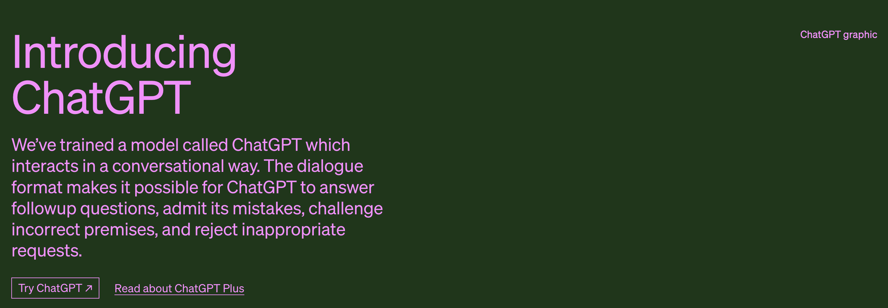
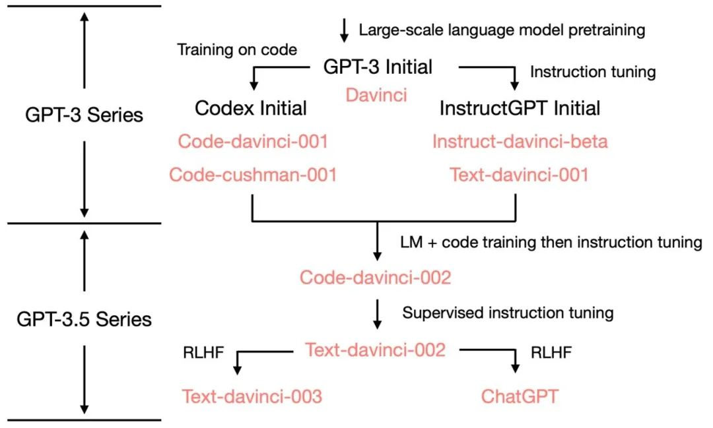
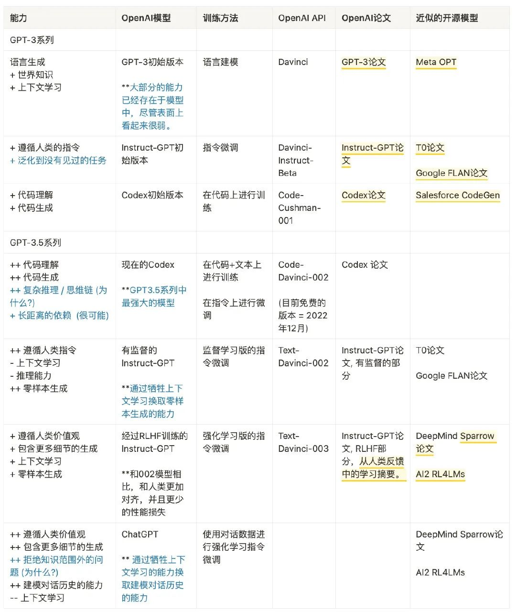

<h1>🧠 Awesome-ChatGPT </h1>

  

ChatGPT资料汇总学习，持续更新......  
ChatGPT再一次掀起了AI的热潮，是否还会像BERT一样成为AI进程上的里程碑事件，还是噱头炒作，持续关注，让时间流淌~  

【大林，NLP/大模型算法工程师， 个人主页】[个人主页](https://www.dalinaip.com/about)  

**特别推荐**一个热门 AI 模型在线体验网站，包括DeepSeek/Qwen/LLAMA/GLM等最新模型，可以免费用10小时、并且使用万卡RTX40系资源 [点这里一键直达](https://www.compshare.cn/image-community?referral_code=px4Z4sZhdgB0ExFvae9SQ&ytag=GPU_Github_dalin)

   

## 紧跟AIGC风向知识库
持续关注AIGC相关动态、研究报告、相关资料、商业落地等，包括但不限于ChatGPT相关问题、AI绘画相关落地、国内大模型研究进展、开源模型进展、资料汇总等  
- 地址：https://szqxz4m7fs.feishu.cn/wiki/wikcnMJ5qdVdOJ03XsBZFuXIRkf

| 拉你入交流群(备注ChaGPT-github) |
| ----  |
|  | 

## GPT-4
【GPT-4】[GPT-4震撼发布：多模态大模型，直接升级ChatGPT、必应，开放API，游戏终结了？](https://mp.weixin.qq.com/s/kA7FBZsT6SIvwIkRwFS-xw)  
【GPT-4】[GPT4震撼发布！哈佛教授：程序员职业3年内将被终结](https://mp.weixin.qq.com/s/c0KR3Jv_1Y3216N7SlOO3Q)  
【真格测试】[GPT3.5-GPT4-百度文心一言，差距还是蛮大的](https://docs.qq.com/sheet/DTEFsdkNERVVtR3BX)  
【PDF资料】[OpenAI发布GPT-4,大模型的发展进入新的里程碑.pdf](GPT4相关/OpenAI发布GPT-4，大模型的发展进入新的里程碑.pdf)  
【PDF资料】[GPT-4-震撼发布,AI算法之巅.pdf](GPT4相关/GPT-4震撼发布-AI算法之巅.pdf)  
【PDF资料】[GPT-4-技术报告-中文.pdf](GPT4相关/GPT-4技术报告.pdf)  
【PDF资料】[GPT-4 Technical Report.pdf](GPT4相关/gpt-4.pdf)  
【更多】https://szqxz4m7fs.feishu.cn/wiki/QpqewmZSjiaNFqkDujSc0Pfjntb  

## 百度-文心一言
【文心一言】[文心一言，期待与你相见](https://mp.weixin.qq.com/s/tUGwuNQi9UjSPVyeEGVEsQ)  
【PDF资料】[华泰证券：文心一言：技术与能力拆解.pdf](百度-文心/华泰证券：文心一言：技术与能力拆解.pdf)  
【PDF资料】[华西证券：百度文心一言畅想.pdf](百度-文心/华西证券：百度文心一言畅想.pdf)  
【PDF资料】[开源证券：百度文心一言展望.pdf](百度-文心/开源证券：百度文心一言展望.pdf)  
【PDF资料】[首创证券：文心一言接入生态伙伴，AIGC关注度持续.pdf](百度-文心/首创证券：文心一言接入生态伙伴，AIGC关注度持续.pdf)  
【PDF资料】[ChatGPT系列—百度文心一言解读20230315.pdf](百度-文心/ChatGPT系列—百度文心一言解读20230315.pdf)  
【PDF资料】[文心一言测试指引.pdf](百度-文心/文心一言测试指引.pdf)  
【更多】https://szqxz4m7fs.feishu.cn/wiki/QpqewmZSjiaNFqkDujSc0Pfjntb  

## 新闻时讯

【时讯】[Google发布Bard与ChatGPT竞争](https://hub.baai.ac.cn/view/23925)  
【时讯】[重磅，微软发布 ChatGPT 版搜索引擎，用上了比 ChatGPT 更强大的技术](https://www.36kr.com/p/2122399289378949)  
【时讯】[今天，微软重新发明搜索引擎：首款ChatGPT搜索来了](https://mp.weixin.qq.com/s/bZlpr4BhL4wpiE0TQovuxg)  
【时讯】[见证历史：ChatGPT版搜索引擎登场，12个新体验太震撼了](https://36kr.com/p/2123086022363273)  
【央视网】[实测“山寨”ChatGPT：费用挺高，答案离谱](https://mp.weixin.qq.com/s/3TF7Yb2uC1PW22K-aSZ3fw)  
【CCTV4】[ChatGPT狂飙！科技巨头纷纷布局](https://mp.weixin.qq.com/s/DGyOK2L-zOhODtWvf-wn-A)  
【机器之心】[微软ChatGPT版必应被黑掉了，全部Prompt泄露](https://mp.weixin.qq.com/s/89KeLjDoS9IyArIr8z6jjg)  
【复旦大学】[资讯｜复旦团队发布国内首个类ChatGPT模型MOSS，邀公众参与内测](https://fddi.fudan.edu.cn/5b/e2/c21257a482274/page.htm)  
【李开复】[李开复最新万字演讲：AI 2.0是绝对不能错过的一次革命](https://mp.weixin.qq.com/s/ddGbZd78BEd65L7599V3Cw)  
【微软】[昨夜，微软甩出Office王炸！又是AI神器，拯救打工人](https://mp.weixin.qq.com/s/DpBo4p9yhlRcERzcbyBQBg)  
【任正非】[任正非最新谈中美、科技、ChatGPT](https://mp.weixin.qq.com/s/7Njd3TYE8PNiKd2M37eGuw)  

## 论文

【OpenAI官方网站】[ChatGPT Blog](https://openai.com/blog/chatgpt/)  
【ChatGPTPro】[ChatGPTPro](https://chatgpt.pro/)  
【GPT-1论文】[Improving Language Understanding by Generative Pre-Training](https://cdn.openai.com/research-covers/language-unsupervised/language_understanding_paper.pdf)  
【GPT-2论文】[Language Models are Unsupervised Multitask Learners](https://cdn.openai.com/better-language-models/language_models_are_unsupervised_multitask_learners.pdf)  
【GPT-3论文】[Language Models are Few-Shot Learners](https://arxiv.org/abs/2005.14165)  
【InstructGPT论文】[Training language models to follow instructions with human feedback](https://arxiv.org/pdf/2203.02155.pdf)  
【RHLF论文】[Augmenting Reinforcement Learning with Human Feedback](https://www.cs.utexas.edu/~ai-lab/pubs/ICML_IL11-knox.pdf)  
【RHLF相关论文12篇】[RHLF论文集](PDF/RLHF论文集/)  
【PPO算法论文】[Proximal Policy Optimization Algorithms](https://arxiv.org/abs/1707.06347)  
【Sparrow】[Improving alignment of dialogue agents via targeted human judgements](https://arxiv.org/abs/2209.14375)  
【LaMda】[LaMDA: Language Models for Dialog Applications](https://arxiv.org/abs/2201.08239)  

## 三方代码实现
【代码实现】 **ColossalAI** [hpcaitech/ColossalAI/ChatGPT](https://github.com/hpcaitech/ColossalAI/tree/main/applications/ChatGPT) , :+1: 如何使用可参考:[博客介绍](https://www.hpc-ai.tech/blog/colossal-ai-chatgpt)

## 资料

【PDF资料】[ChatGPT-真格基金分享.pdf](PDF/ChatGPT-真格基金分享.pdf)  
【PDF资料】[腾讯研究院AIGC发展趋势报告2023.pdf](PDF/腾讯研究院AIGC发展趋势报告2023.pdf)  
【PDF资料】[从CHAT_GPT到生成式AI（Generative AI）：人工智能新范式，重新定义生产力.pdf](PDF/从CHAT_GPT到生成式AI.pdf)  
【PDF资料】[ChatGPT - 开启AI新纪元.pdf](PDF/ChatGPT-开启AI新纪元.pdf)  
【PDF资料】[ChatGPT研究框架](https://mp.weixin.qq.com/s/YtJn2pfdS_on1nSATOylYw)  
【PDF资料】[ChatGPT研究框架2023.pdf](PDF/ChatGPT研究框架2023.pdf)  
【PDF资料】[AIGC行业深度报告-ChatGPT-重新定义搜索“入口”.pdf](PDF/AIGC行业深度报告-ChatGPT-重新定义搜索“入口”.pdf)  
【PDF资料】[三分钟看懂ChatGPT.pdf](PDF/三分钟看懂ChatGPT.pdf)  
【PDF资料】[从ChatGPT到通用智能新长征上的新变化.pdf](PDF/从ChatGPT到通用智能新长征上的新变化.pdf)  
【PDF资料】[像ChatGPT这样的工具如何改变你的企业.pdf](PDF/像ChatGPT这样的工具如何改变你的企业.pdf)  
【PDF资料】[揭秘ChatGPT身后的AIGC技术和它的中国同行们.pdf](PDF/揭秘ChatGPT身后的AIGC技术和它的中国同行们.pdf)  
【PDF资料】[ChatGPT_Prompts_使用场景.pdf](PDF/ChatGPT/ChatGPT_Prompts_使用场景.pdf)  
【PDF资料】[ChatGPT过去现在与未来.pdf](PDF/ChatGPT/ChatGPT过去现在与未来.pdf)   
【更多】https://szqxz4m7fs.feishu.cn/wiki/QpqewmZSjiaNFqkDujSc0Pfjntb  

 

## 技术解读

【技术解读】[huggingface解读 Illustrating Reinforcement Learning from Human Feedback (RLHF) ](https://huggingface.co/blog/rlhf)  
【技术解读】[ChatGPT发展历程、原理、技术架构详解和产业未来 （收录于先进AI技术深度解读）](https://zhuanlan.zhihu.com/p/590655677)  
【技术解读】[ChatGPT内核：InstructGPT，基于反馈指令的PPO强化学习](https://zhuanlan.zhihu.com/p/589747432)  
【技术解读】[HuggingFace-解读 ChatGPT 背后的技术重点：RLHF、IFT、CoT、红蓝对抗](https://zhuanlan.zhihu.com/p/602458131)  
【技术解读】[从零实现ChatGPT——RLHF技术笔记](https://zhuanlan.zhihu.com/p/591474085)  
【技术解读】[张俊林-通向AGI之路：大型语言模型（LLM）技术精要](https://zhuanlan.zhihu.com/p/597586623)  
【技术解读】[ChatGPT/InstructGPT详解](https://zhuanlan.zhihu.com/p/590311003)  
【技术解读】[ 赛尔笔记 | 浅析ChatGPT的原理及应用 ](https://mp.weixin.qq.com/s/wLVoY6BwWd9p4DqrpOMOxg)  
【技术解读】[抱抱脸：ChatGPT背后的算法——RLHF | 附12篇RLHF必刷论文(论文在上面资料中)](https://zhuanlan.zhihu.com/p/592671478)  
【技术解读】[ChatGPT背后人工智能算法全部由国外公司发明](https://xueqiu.com/5760078642/241228577)  
【技术解读】[万字拆解！追溯ChatGPT各项能力的起源](https://mp.weixin.qq.com/s/VYv8BRgGnp9ZTuXxaSuFwg)  
【技术解读】[拆解追溯 GPT-3.5 各项能力的起源](https://yaofu.notion.site/GPT-3-5-360081d91ec245f29029d37b54573756)  
【技术解读】[ChatGPT出来后，我们是否真的面临范式转变?](https://mp.weixin.qq.com/s/60_h5biTOlBAa3Rt2tMn6A)  
【技术解读】[腾讯技术工程|万字长文教你如何做出 ChatGPT](https://mp.weixin.qq.com/s/8IFcQDhsLIWJIx8siF-wdQ)  
【腾讯】[关于ChatGPT的五个最重要问题](https://mp.weixin.qq.com/s/ACMAeGi0LPRWt2B8VrIojQ)

## 视频讲解
【李宏毅】[ChatGPT (可能)是怎麼煉成的 - GPT 社會化的過程](https://www.bilibili.com/video/BV1U84y167i3?p=1&vd_source=71b548de6de953e10b96b6547ada83f2)   
【陈縕侬】[深度學習之應用 | ADL 17.3: OpenAI ChatGPT 驚驗眾人的對話互動式AI](https://www.bilibili.com/video/BV1U84y167i3?p=3&vd_source=71b548de6de953e10b96b6547ada83f2)  
【李沐】[InstructGPT 论文精读【论文精读·48】](https://www.bilibili.com/video/BV1hd4y187CR/?spm_id_from=333.788&vd_source=71b548de6de953e10b96b6547ada83f2)  
【油管】[chatgpt基本工作原理简单清晰介绍](https://www.youtube.com/watch?v=e0aKI2GGZNg&t=24s)  

## 中文ChatGPT
【复旦大学】[资讯｜复旦团队发布国内首个类ChatGPT模型MOSS，邀公众参与内测](https://fddi.fudan.edu.cn/5b/e2/c21257a482274/page.htm)  
【复旦Moss】[https://moss.fastnlp.top/](https://moss.fastnlp.top/)  
【复旦Moss GitHub】[https://github.com/txsun1997/MOSS](https://github.com/txsun1997/MOSS)  

## GitHub-ChatGPT

【GitHub】[在微信上迅速接入 ChatGPT，让它成为你最好的助手！](https://github.com/fuergaosi233/wechat-chatgpt)  
【GitHub】[Reverse Engineered ChatGPT API by OpenAI. Extensible for chatbots etc.](https://github.com/acheong08/ChatGPT)  
【github】[This is a collection of prompt examples to be used with the ChatGPT model.](https://github.com/f/awesome-chatgpt-prompts)  
【GitHub】[ChatGPT Desktop Application (Mac, Windows and Linux)](https://github.com/lencx/ChatGPT)  
【GitHub】[ChatGPT 中文调教指南](https://github.com/PlexPt/awesome-chatgpt-prompts-zh)  
【GitHub】[Node.js client for the unofficial ChatGPT API.](https://github.com/transitive-bullshit/chatgpt-api)  
【GitHub】[几步即可获得一个基于 ChatGPT 的微信机器人](https://github.com/AutumnWhj/ChatGPT-wechat-bot)  
【GitHub】[ChatGPT for Google](https://github.com/wong2/chatgpt-google-extension)    
【GitHub】[Curated list of resources for ChatGPT and GPT-3 from OpenAI](https://github.com/humanloop/awesome-chatgpt)  
【GitHub】[OpenAI ChatGPT 的逆向工程SDK。直接使用网页最新ChatGPT。](https://github.com/PlexPt/chatgpt-java)  
【GitHub】[ChatGPT Android demonstrates OpenAI's ChatGPT on Android with Stream Chat SDK for Compose.](https://github.com/skydoves/chatgpt-android)  
【GitHub】[ChatGPT Extension for VSCode](https://github.com/mpociot/chatgpt-vscode)  
【GitHub】[ChatGPT Desktop App](https://github.com/sonnylazuardi/chatgpt-desktop)  
【GitHub】[PyChatGPT](https://github.com/rawandahmad698/PyChatGPT)  
【GitHub】[OpenAI Teams Bot app](https://github.com/formulahendry/openai-teams-bot)  
【GitHub】[chatgpt.js client-side library](https://github.com/chatgptjs/chatgpt.js)  
【GitHub】[ChatGPT Auto Refresh keeps ChatGPT sessions fresh to avoid network errors + Cloudflare checks](https://github.com/adamlui/chatgpt-auto-refresh)  
【GitHub】[DuckDuckGPT adds ChatGPT to DuckDuckGo](https://github.com/kudoai/duckduckgpt)  
【GitHub】[BraveGPT adds ChatGPT to Brave Search](https://github.com/kudoai/bravegpt)  
【GitHub】[ChatGPT Auto-Continue automatically continues generating multi-message responses](https://github.com/adamlui/chatgpt-auto-continue)  
【GitHub】[ChatGPT Infinity generates endless answers to random questions in any language](https://github.com/adamlui/chatgpt-infinity)  
【GitHub】[ChatGPT Widescreen adds widescreen + full-window modes](https://github.com/adamlui/chatgpt-widescreen)  
【GitHub】[Autoclear ChatGPT History](https://github.com/adamlui/autoclear-chatgpt-history)  
【GitHub】[Chatpad](https://github.com/Pi-31415/Chatpad/)

## GitHub-ChatGPT-周边
【ChatRWKV】[ChatRWKV is like ChatGPT but powered by my RWKV language model](https://github.com/BlinkDL/ChatRWKV)  

## GitHub-GPT系列
【GPT系列项目】[GPT2-Chinese](https://github.com/Morizeyao/GPT2-Chinese)  

## 实践

【实践】[量子位-ChatGPT能接入微信了！](https://zhuanlan.zhihu.com/p/590505058)  
【实践】[在国内，如何玩一下chatgpt？](https://www.zhihu.com/question/570939438)  
【小白注册教程】[ChatGPT 怎么用最新详细教程-新手小白一看就会](https://www.cnblogs.com/chat-gpt/p/how-to-use-chatgpt-in-china.html)  
【飞书】[飞书接入ChatGPT教程](https://github.com/bestony/ChatGPT-Feishu) 

## 相关文章

【知乎问答】[ChatGPT 爆火，谷歌投资其竞品公司，谷歌创始人亲自下场改代码，这场 AI 风暴对巨头们有何冲击？](https://www.zhihu.com/question/582114806)  
【知乎问答】[ChatGPT 有哪些神奇的使用方式？](https://www.zhihu.com/question/570729170)  
【知乎问答】[Chat GPT有多高的技术壁垒？国内外除了OpenAI还有谁可以做到类似程度？ ?](https://www.zhihu.com/question/581806122)  
【知乎问答】[阻碍国内团队研究 ChatGPT 这样产品的障碍有哪些，技术，钱，还是领导力？](https://www.zhihu.com/question/570782945)  
【知乎问答】[以 ChatGPT 为代表的「大模型」会是多大的技术革命？如果要发生技术革命需要具备哪些条件？](https://www.zhihu.com/question/581311491)  
【知乎问答】[国内首个 ChatGPT 检测器发布，它是如何区别人类与 AI 的？我们还能做什么？](https://www.zhihu.com/question/578268304)  
【知乎问答】[OpenAI 的超级对话模型 ChatGPT 会导致程序员大规模失业吗？](https://www.zhihu.com/question/570403406)  
【知乎问答】[ChatGPT 离真正的商业化落地还有多远？](https://www.zhihu.com/question/578492084)  
【知乎问答】[ChatGPT 已经对码农造成了什么影响？](https://www.zhihu.com/question/579037511)  
【知乎问答】[ChatGPT的出现会不会导致底层程序员失业？](https://www.zhihu.com/question/570596331)  
【知乎问答】[国内有类似 ChatGPT 能力的模型吗？](https://www.zhihu.com/question/570713548)  
【知乎问答】[如何评价 ChatGPT ？会取代搜索引擎吗？](https://www.zhihu.com/question/570062224)  
【张俊林】[ChatGPT会取代搜索引擎吗](https://zhuanlan.zhihu.com/p/589533490)  
【新智元】[ChatGPT爆火，LeCun心态崩了！称大语言模型是邪路，Meta模型3天惨遭下线](https://mp.weixin.qq.com/s/Q9H-78VyI1tZ_9u1kvF_nA)  
【知乎问答】[如何评价 OpenAI 的超级对话模型 ChatGPT ？](https://www.zhihu.com/question/570189639)  
【知乎问答】[百度类似 ChatGPT 的项目名字确定为「文心一言」，三月份完成内测，哪些信息值得关注？](https://www.zhihu.com/question/582588618)  
【谷歌CEO】[An important next step on our AI journey](https://blog.google/technology/ai/bard-google-ai-search-updates/)  
【知乎问答】[OpenAI 的 ChatGPT 会怎样影响国内的 NLP 研究？](https://www.zhihu.com/question/571460238)  
【量子位】[ChatGPT偷家：Stack Overflow正被程序员抛弃，访问量一个月骤降3200W](https://zhuanlan.zhihu.com/p/602818608)  
【ChatGPT之父】[ 对话ChatGPT之父！AI会改变什么？不会改变什么](https://mp.weixin.qq.com/s/B5Aku-r4jQYVfO89jxu_Xg)  
【知乎问答】[ChatGPT 最容易取代的是哪些领域？](https://www.zhihu.com/question/582498339/answer/2918852536)  
【知乎问答】[ChatGPT最实用的提示（Prompts）写法有哪些？](https://www.zhihu.com/question/584402332)  

## 欢迎共建
【👬🏻】、欢迎👏🏻 Star ⭐️⭐️⭐️⭐️⭐️ && 提交 Pull requests 👏🏻👏🏻👏🏻  

## 交流共享
群满加我微信(备注github-ChatGPT), 行路难，感谢老板随意赏~  

    

## 关于我
【大林，NLP/大模型算法工程师， 个人主页】[个人主页](https://www.dalinaip.com/about)  

### Star History

# ⚠️声明
以上资料来自网络整理，供大家学习参考，如有侵权，麻烦联系我删除！  
v: dalinvip2023  
